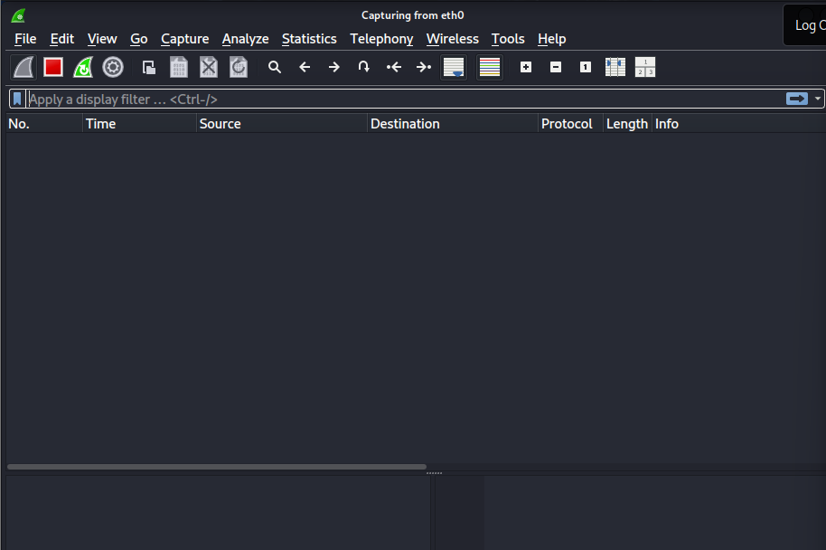
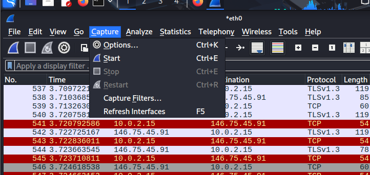
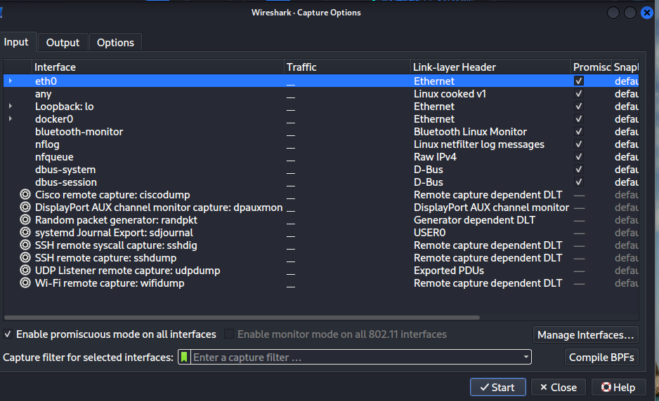
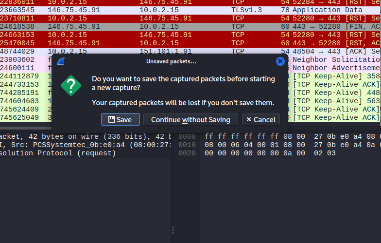
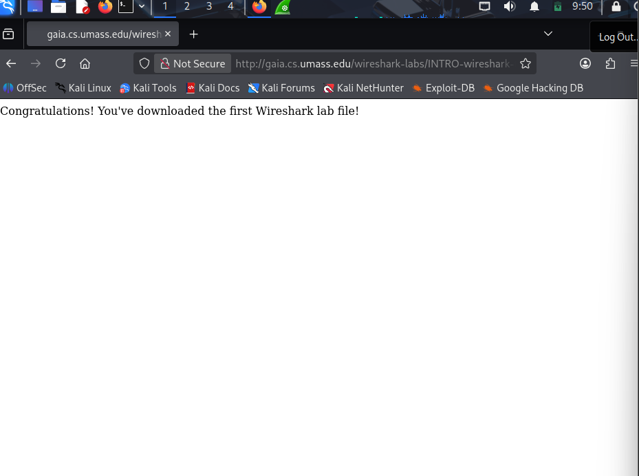
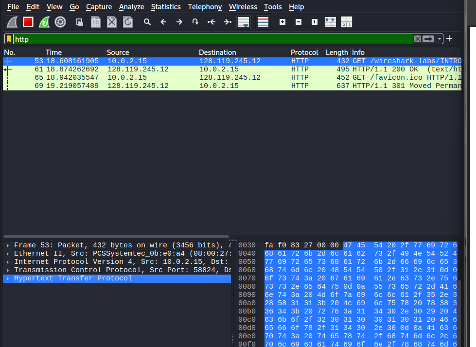
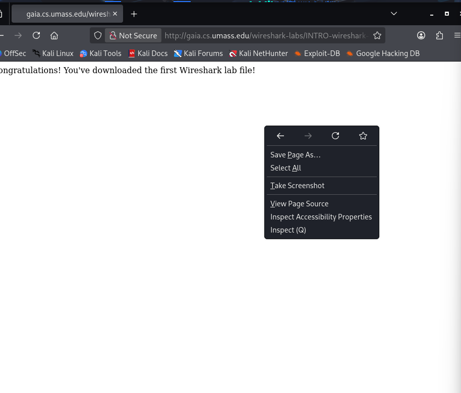
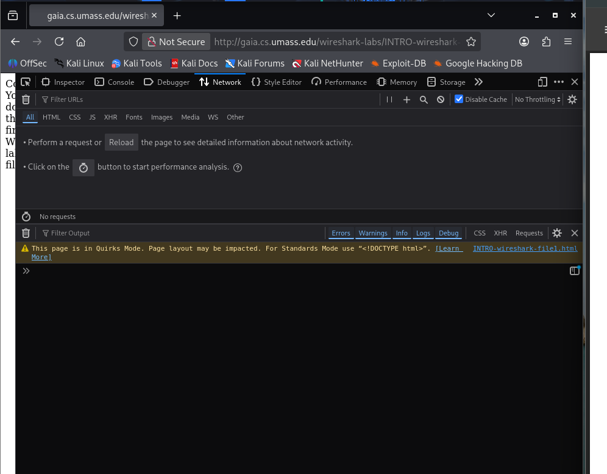
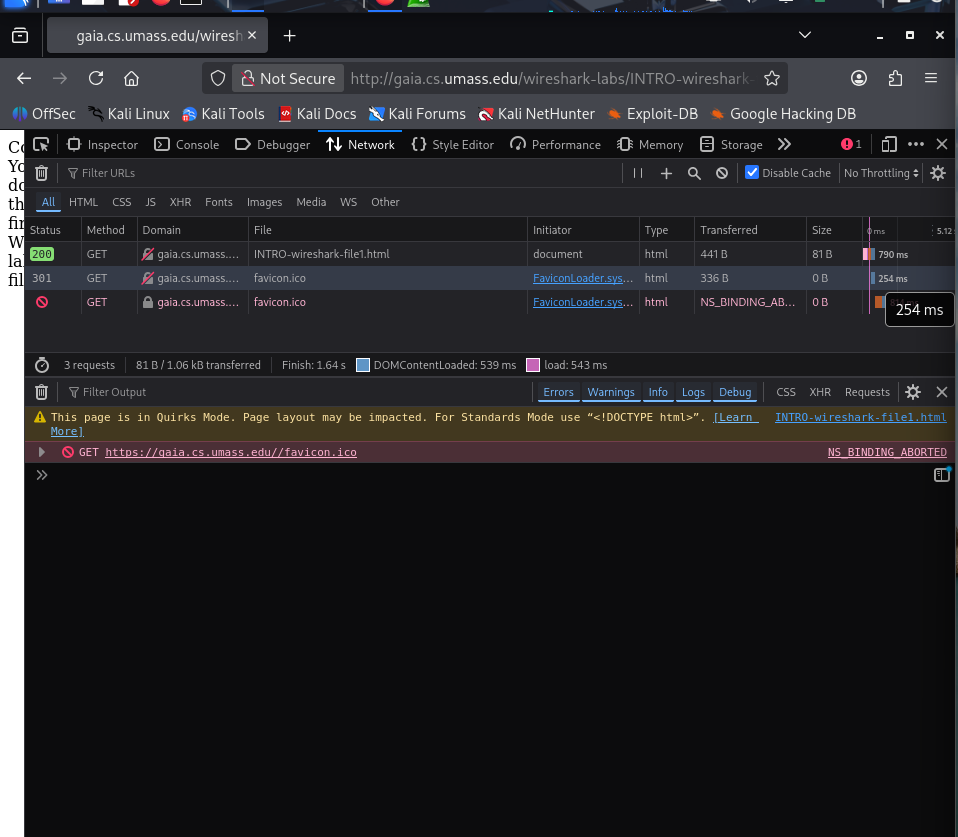
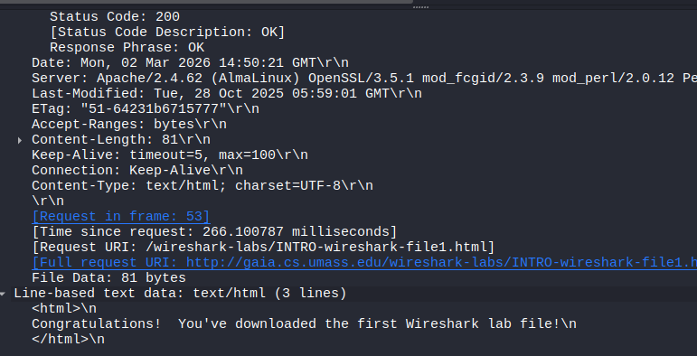

# Panduan Penggunaan Burp Suite: Intercepting & Analysing Traffic

Dokumentasi ini menjelaskan langkah-langkah dasar melakukan intercept traffic menggunakan Burp Suite untuk analisis keamanan web.

---

## 1. Persiapan Proyek (Startup)

Langkah awal adalah membuka aplikasi dan menentukan jenis proyek.

* **Langkah:** Pilih **Temporary project** (opsi default pada versi Community). Klik **Next**.

* **Langkah:** Pilih **Use Burp defaults** untuk menggunakan konfigurasi standar. Klik **Start Burp**.

---

## 2. Mengaktifkan Browser Internal

Burp Suite menyediakan browser bawaan yang sudah terkonfigurasi otomatis dengan proxy.

* **Langkah:** Masuk ke tab **Proxy** > **Intercept**. Pastikan tombol **Intercept is on** aktif, lalu klik **Open Browser**.

---

## 3. Melakukan Intercept Request

Proses menangkap data yang dikirimkan dari browser ke server.

* **Langkah:** Masukkan URL target di browser internal. Burp akan menangkap request tersebut. Klik **Forward** untuk meneruskan satu per satu, atau **Drop** untuk membatalkan request.

* **Langkah:** Jika ingin mematikan fungsi penahanan sementara agar traffic mengalir lancar, klik tombol **Intercept is on** hingga berubah menjadi **Intercept is off**.

---

## 4. Analisis HTTP History

Melihat rekam jejak semua request yang telah melalui proxy.

* **Langkah:** Pindah ke sub-tab **HTTP history**. Di sini Anda bisa melihat daftar URL, metode (GET/POST), dan status code.

* **Detail:** Klik pada salah satu baris history untuk melihat detail **Request** (data yang dikirim) dan **Response** (balasan dari server) di panel bagian bawah.

---

## 5. Manipulasi dan Pengiriman Ulang (Repeater)

Gunakan fitur Repeater untuk mengubah parameter dan mengirim ulang request tanpa harus mengisi form di browser berkali-kali.

* **Langkah:** Klik kanan pada request di HTTP history, lalu pilih **Send to Repeater**. Pindah ke tab **Repeater**.

* **Langkah:** Di tab Repeater, Anda bisa memodifikasi isi Request. Klik **Send** untuk mengeksekusi.

* **Hasil:** Hasil modifikasi akan langsung terlihat di panel **Response**. Ini sangat berguna untuk mencari celah keamanan seperti SQLi atau IDOR.

---

> **Catatan:** Selalu pastikan Anda memiliki izin legal sebelum melakukan testing pada domain/aplikasi tertentu.