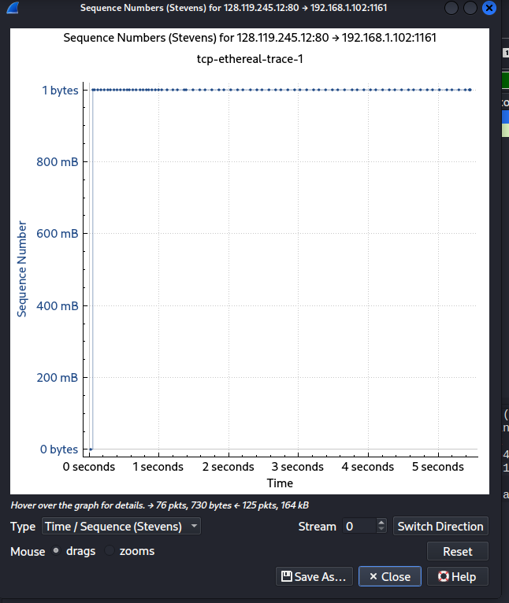

# Analisis TCP Time-Sequence-Graph (Stevens)

Berdasarkan analisis grafik **Time-Sequence-Graph (Stevens)** dari berkas *trace* `tcp-ethereal-trace-1` yang ditampilkan pada berkas aset modul ini, berikut adalah laporan analisis mendalam mengenai fase **Slow Start**, **Congestion Avoidance**, serta perbandingannya dengan perilaku ideal TCP.

---

## 1. Tampilan Grafik Analisis

Berikut adalah visualisasi grafik kontrol kongesti TCP yang dianalisis:

*Catatan: Jika Anda menyimpan gambar grafik di folder yang berbeda, pastikan jalur berkas (path) di atas disesuaikan.*

---

## 2. Identifikasi Fase Slow Start dan Congestion Avoidance

### A. Fase Slow Start
* **Titik Mulai:** Fase *Slow Start* dimulai tepat pada awal transmisi data, yaitu pada waktu **$t = 0$ detik**.
* **Karakteristik & Titik Selesai:** Fase ini berlangsung sangat singkat (dalam fraksi milidetik pertama setelah $t = 0$ s). Pada grafik, hal ini ditandai dengan garis vertikal yang melonjak sangat tajam dari **0 bytes** langsung menuju ke area atas mendekati nilai puncaknya (sekitar 1 byte skala relatif teratas). Secara teoritis, pada fase ini ukuran jendela kongesti (*congestion window* / `cwnd`) meningkat secara eksponensial setiap kali menerima ACK, sehingga segmen data dikirimkan dalam jumlah yang berlipat ganda dengan sangat cepat dalam satu waktu simultan (*burst*).

### B. Algoritma Congestion Avoidance
* **Titik Pengambilalihan:** Algoritma *Congestion Avoidance* mengambil alih segera setelah lonjakan tajam *Slow Start* selesai, yaitu hampir langsung di awal pengiriman data (masih berada di sekitar wilayah dekat **$t = 0$ detik**).
* **Karakteristik:** Setelah lonjakan vertikal pertama, plot grafik berubah menjadi sebuah garis horizontal mendatar yang sangat stabil sepanjang sumbu waktu (dari $0$ detik hingga melebihi $5$ detik). Pola mendatar ini menunjukkan bahwa nomor urut (*Sequence Number*) segmen berikutnya dikirimkan secara konstan atau kenaikannya sangat linier dan lambat, yang merupakan ciri khas dari kontrol kongesti *Congestion Avoidance* (di mana `cwnd` hanya bertambah $+1$ MSS setiap RTT untuk menghindari penyumbatan jaringan).

---

## 3. Perbandingan Data Pengukuran vs Perilaku Ideal TCP

Terdapat perbedaan yang sangat mencolok antara data riil pada grafik *trace* ini dengan model perilaku ideal TCP (seperti algoritma TCP Tahoe atau Reno) yang dipelajari di buku teks:

1. **Ketiadaan Pola "Gigi Gergaji" (*Sawtooth Pattern*):**
   * **Perilaku Ideal:** TCP ideal biasanya akan terus menaikkan `cwnd` pada fase *Slow Start* hingga terjadi *packet loss*, kemudian jendela kongesti akan turun drastis (kembali ke 1 atau berkurang setengahnya), lalu naik kembali secara linier pada fase *Congestion Avoidance*, membentuk pola naik-turun menyerupai gigi gergaji.
   * **Data Riil:** Pada grafik ini, sama sekali tidak ditemukan adanya penurunan *Sequence Number* ataupun penurunan tajam pada grafik. Kurva langsung mendatar stabil. Ini menunjukkan bahwa transmisi berjalan sangat mulus tanpa adanya *packet loss* (kehilangan paket) atau pembuangan paket (*dropped packets*) di sepanjang jalur jaringan.

2. **Transmisi Berbentuk Garis Stabil Horisontal:**
   * **Perilaku Ideal:** Grafik ideal umumnya terus menunjukkan tren naik secara diagonal karena data dikirimkan secara berkelanjutan (*continuous streaming*).
   * **Data Riil:** Grafik yang cenderung konstan mendatar ini mengindikasikan bahwa laju pengiriman data dari klien dibatasi oleh kapasitas jendela penerima (*Receiver Window* / `rwnd`) yang diiklankan oleh server, atau laju pengiriman data aplikasi memang stabil pada batas tersebut sehingga tidak memicu peningkatan *Sequence Number* yang agresif secara vertikal melebihi kapasitas alokasi yang ada.

---

*Informasi Tambahan Aliran Paket:*
Grafik ini memplot arah aliran paket dari **128.119.245.12:80** (Server) menuju **192.168.1.102:1161** (Klien), menunjukkan aktivitas penerimaan segmen data atau ACK di sisi penerima selama rentang waktu jalannya trace (Total: 76 paket dikirim, 730 bytes; 125 paket diterima, 164 kB).
